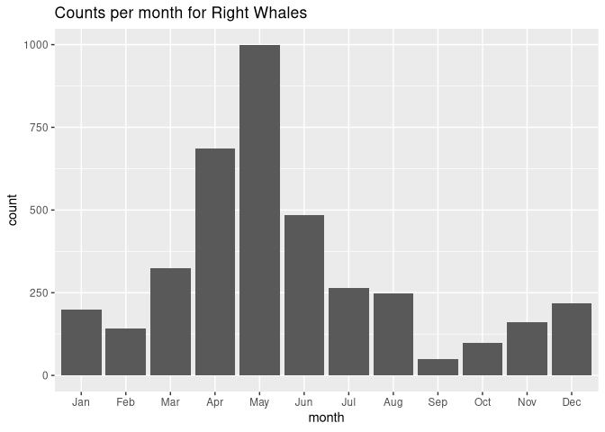
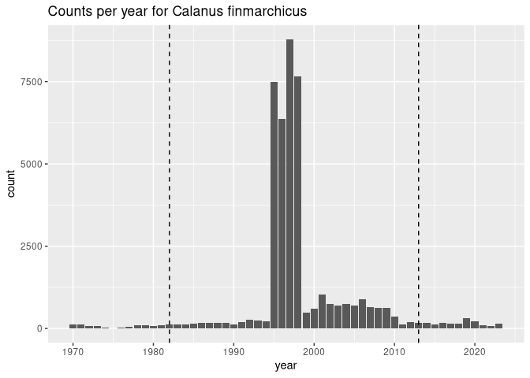
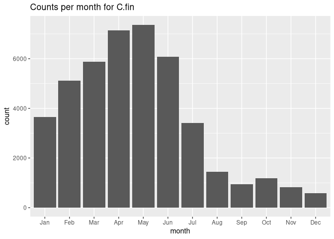

C03_assignment.Rmd
================
Izzy Gottlieb
2026-01-20

<!-- There will be two species, the Right Whale, which shares a favorite food with the Basking Shark. The second creature is the favorite food in question.  -->

    ## Simple feature collection with 3872 features and 7 fields
    ## Geometry type: POINT
    ## Dimension:     XY
    ## Bounding box:  xmin: -74.583 ymin: 38.81521 xmax: -65.0203 ymax: 45.07784
    ## Geodetic CRS:  WGS 84
    ## # A tibble: 3,872 × 8
    ##    id             basisOfRecord eventDate   year month eventTime individualCount
    ##  * <chr>          <chr>         <date>     <dbl> <fct> <chr>               <dbl>
    ##  1 0010fede-89a5… HumanObserva… 2004-04-18  2004 Apr   17:40:38Z               1
    ##  2 001648b3-df39… HumanObserva… 2022-04-04  2022 Apr   21:01:46Z               5
    ##  3 005b73cf-9745… HumanObserva… 2010-01-24  2010 Jan   15:24:26Z               4
    ##  4 0076b088-774e… HumanObserva… 1998-08-02  1998 Aug   18:22:19Z               1
    ##  5 008400f9-a1f3… HumanObserva… 2011-05-02  2011 May   16:17:43Z               1
    ##  6 00a2b378-a371… HumanObserva… 2007-10-26  2007 Oct   17:59:43Z               1
    ##  7 00af01be-8cb8… HumanObserva… 2008-07-10  2008 Jul   20:24:09Z               8
    ##  8 00d9f6fd-3026… HumanObserva… 2000-05-26  2000 May   17:44:27Z               1
    ##  9 01087e2e-866f… HumanObserva… 2002-05-04  2002 May   19:07:47Z               2
    ## 10 0180b939-1ef6… HumanObserva… 2009-11-09  2009 Nov   17:56:29Z              11
    ## # ℹ 3,862 more rows
    ## # ℹ 1 more variable: geom <POINT [°]>

<!-- Here is the plot for the months. It looks like Right Whales prefer the spring.  -->

<!-- -->

    ## Simple feature collection with 43639 features and 7 fields
    ## Geometry type: POINT
    ## Dimension:     XY
    ## Bounding box:  xmin: -73.8683 ymin: 38.8 xmax: -65 ymax: 45.29
    ## Geodetic CRS:  WGS 84
    ## # A tibble: 43,639 × 8
    ##    id             basisOfRecord eventDate   year month eventTime individualCount
    ##  * <chr>          <chr>         <date>     <dbl> <fct> <chr>               <dbl>
    ##  1 0005bdf5-aeb9… HumanObserva… 1998-06-18  1998 Jun   <NA>                   NA
    ##  2 0006e26a-42b5… HumanObserva… 1997-05-20  1997 May   <NA>                   NA
    ##  3 0008212e-e7e7… HumanObserva… 1997-04-24  1997 Apr   <NA>                   NA
    ##  4 0009746b-09db… HumanObserva… 1997-05-28  1997 May   <NA>                   NA
    ##  5 000a608f-db94… PreservedSpe… 1994-05-15  1994 May   <NA>                    6
    ##  6 000abdc4-e1ba… HumanObserva… 1996-05-12  1996 May   <NA>                   NA
    ##  7 000affaa-9afa… HumanObserva… 1996-02-22  1996 Feb   <NA>                   NA
    ##  8 000b5c95-0a6f… HumanObserva… 1998-06-20  1998 Jun   <NA>                   NA
    ##  9 000b8326-aa82… HumanObserva… 1995-06-12  1995 Jun   <NA>                   NA
    ## 10 000e05a0-c67f… HumanObserva… 2016-07-27  2016 Jul   <NA>                   NA
    ## # ℹ 43,629 more rows
    ## # ℹ 1 more variable: geom <POINT [°]>

<!-- Here are the counts for both the year and month for Calanus finmarchicus, the creature which both the Basking Shark and Right Whale. -->

<!-- -->
<!-- -->
