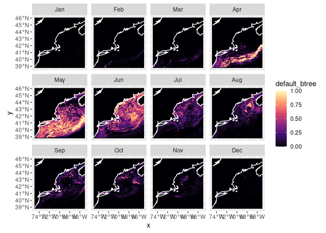
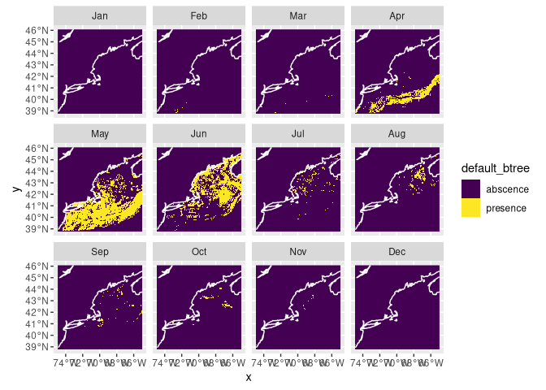
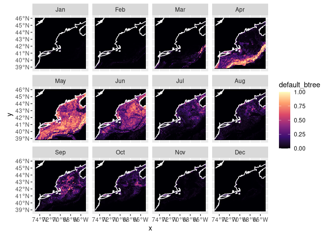

Prediction
================

> It’s tough to make predictions, especially about the future.  
> Yogi Berra

Finally we come to the end product of forecasting: prediction. This last
step is actually fairly simple, given a recipe and model (now bundled in
a `workflow` container). We want to predict across the entire domain of
our Brickman data set. You may recall that we are able to read these
arrays, display them and extract point data from them. But we haven’t
used them *en mass* as a variable yet.

# Setup

As always, we start by running our setup function. Start RStudio/R, and
reload your project with the menu `File > Recent Projects`.

``` r
source("setup.R")
```

# Load the Brickman data

We are going to make a prediction about the present, which means it
something akin to a
[nowcast](https://en.wikipedia.org/wiki/Nowcasting_(economics)).

``` r
cfg = read_configuration(scientificname = "Cetorhinus Maximus",
                         version = "v1", 
                         path = data_path("models"))
db = brickman_database()
present_conditions = read_brickman(db |> filter(scenario == "PRESENT", 
                                                interval == "mon"),
                       add = c("depth", "month")) |>
  select(all_of(cfg$keep_vars))
```

# Load the workflow

We read the model information we created last time.

``` r
model_fits = read_model_fit(filename = "Cetorhinus_Maximus-v1-model_fits")
model_fits
```

    ## # A tibble: 4 × 7
    ##   wflow_id   splits              id    .metrics .notes   .predictions .workflow 
    ##   <chr>      <list>              <chr> <list>   <list>   <list>       <list>    
    ## 1 default_g… <split [8909/2060]> trai… <tibble> <tibble> <tibble>     <workflow>
    ## 2 default_rf <split [8909/2060]> trai… <tibble> <tibble> <tibble>     <workflow>
    ## 3 default_b… <split [8909/2060]> trai… <tibble> <tibble> <tibble>     <workflow>
    ## 4 default_m… <split [8909/2060]> trai… <tibble> <tibble> <tibble>     <workflow>

``` r
nowcast = predict_stars(model_fits, present_conditions)
nowcast
```

    ## stars object with 3 dimensions and 4 attributes
    ## attribute(s):
    ##                         Min.      1st Qu.       Median       Mean     3rd Qu.
    ## default_glm     2.220446e-16 2.220446e-16 2.141740e-08 0.02703105 0.001565791
    ## default_rf      3.515954e-02 1.169902e-01 2.096372e-01 0.25802701 0.384649010
    ## default_btree   9.605762e-06 2.404335e-04 2.404335e-04 0.06042748 0.010248049
    ## default_maxent  6.722241e-04 5.590443e-02 2.121891e-01 0.27318665 0.462273213
    ##                      Max.  NA's
    ## default_glm     0.7416474 59796
    ## default_rf      0.7849552 59796
    ## default_btree   0.9964153     0
    ## default_maxent  0.8131321 59796
    ## dimension(s):
    ##       from  to offset    delta refsys point      values x/y
    ## x        1 121 -74.93  0.08226 WGS 84 FALSE        NULL [x]
    ## y        1  89  46.08 -0.08226 WGS 84 FALSE        NULL [y]
    ## month    1  12     NA       NA     NA    NA Jan,...,Dec

Now we can plot what is often called a “habitat suitability index” (hsi)
map. We can

``` r
plot_prediction(nowcast['default_btree'])
```

    ## numeric

<!-- -->

We can also plot a presence/absence labeled map, but keep in mind it is
just a thresholded version of the above where “presence” means
`prediction >= 0.5`. Of course, you can select other values to threshold
the habitat suitablility scores.

``` r
pa_nowcast = threshold_prediction(nowcast)
plot_prediction(pa_nowcast['default_btree'])
```

<!-- -->

## Forecast

Now let’s try our hand at forecasting - let’s try RCP85 in 2075. First
we load those parameters, then run the prediction and plot.

``` r
covars_rcp85_2075 = read_brickman(db |> filter(scenario == "RCP85", 
                                               year == 2075, 
                                               interval == "mon"),
                                  add = c("depth", "month")) |>
  select(all_of(cfg$keep_vars))
```

``` r
forecast_2075 = predict_stars(model_fits, covars_rcp85_2075)
forecast_2075
```

    ## stars object with 3 dimensions and 4 attributes
    ## attribute(s):
    ##                         Min.      1st Qu.       Median       Mean     3rd Qu.
    ## default_glm     2.220446e-16 2.220446e-16 2.406501e-08 0.02926874 0.001712827
    ## default_rf      3.502273e-02 1.374025e-01 2.315732e-01 0.26622854 0.382693376
    ## default_btree   1.358040e-05 2.404335e-04 2.404335e-04 0.05718740 0.013869312
    ## default_maxent  3.805463e-04 6.168471e-02 2.187641e-01 0.26673653 0.424097292
    ##                      Max.  NA's
    ## default_glm     0.8560444 59796
    ## default_rf      0.6917907 59796
    ## default_btree   0.9877517     0
    ## default_maxent  0.7991995 59796
    ## dimension(s):
    ##       from  to offset    delta refsys point      values x/y
    ## x        1 121 -74.93  0.08226 WGS 84 FALSE        NULL [x]
    ## y        1  89  46.08 -0.08226 WGS 84 FALSE        NULL [y]
    ## month    1  12     NA       NA     NA    NA Jan,...,Dec

``` r
plot_prediction(forecast_2075['default_btree'])
```

    ## numeric

<!-- -->

## Save the predictions

It’s easy to save the predictions (and read then back with
`read_prediction()`).

``` r
# make sure the output directory exists
path = make_path("predictions")

write_prediction(nowcast,
                 scientificname = cfg$scientificname,
                 version = cfg$version,
                 year = "CURRENT",
                 scenario = "CURRENT")
write_prediction(forecast_2075,
                 scientificname = cfg$scientificname,
                 version = cfg$version,
                 year = "2075",
                 scenario = "RCP85")
```

``` r
# make sure the output directory exists

path = make_path("predictions")
write_prediction(forecast_2075,
                 scientificname = cfg$scientificname,
                 version = cfg$version,
                 year = "PRESENT",
                 scenario = "CURRENT")
```

``` r
# make sure the output directory exists
path = make_path("predictions")
write_prediction(forecast_2075,
                 scientificname = cfg$scientificname,
                 version = cfg$version,
                 year = "2075",
                 scenario = "RCP45")
```

``` r
path = make_path("predictions")
write_prediction(forecast_2075,
                 scientificname = cfg$scientificname,
                 version = cfg$version,
                 year = "2055",
                 scenario = "RCP45")
```

``` r
path = make_path("predictions")
write_prediction(forecast_2075,
                 scientificname = cfg$scientificname,
                 version = cfg$version,
                 year = "2055",
                 scenario = "RCP85")
```

``` r
path = make_path("predictions")
write_prediction(forecast_2075,
                 scientificname = cfg$scientificname,
                 version = cfg$version,
                 year = "2075",
                 scenario = "RCP85")
```

# Recap

We made both a nowcast and a predictions using previously saved model
fits. Contrary to Yogi Berra’s claim, it’s actually pretty easy to
predict the future. Perhaps more challenging is to interpret the
prediction. We bundled these together to make time series plots, and we
saved the predicted values.

# Coding Assignment

For each each climate scenario create a monthly forecast (so that’s
three time periods: PRESENT, 2055 and 2075 and three scenarios CURRENT,
RCP45, RCP85) and save each to in your `predictions` directory. In the
end you should have 5 files saved (one for PRESENT and two each for 2055
and 2075).

Do the same for your second species. Ohhh, perhaps this a good time for
another R markdown or R script to keep it all straight?
