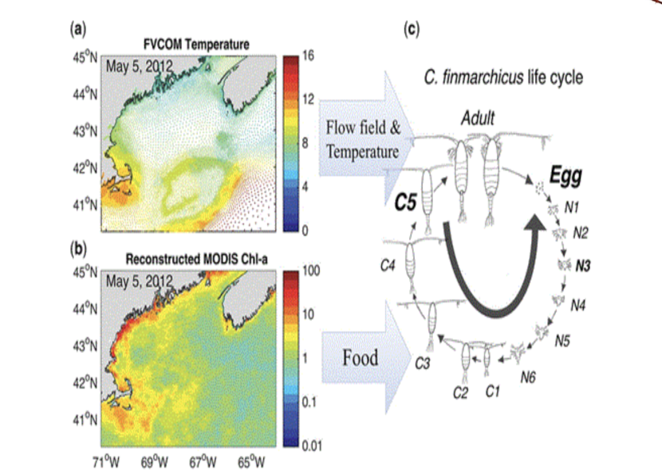
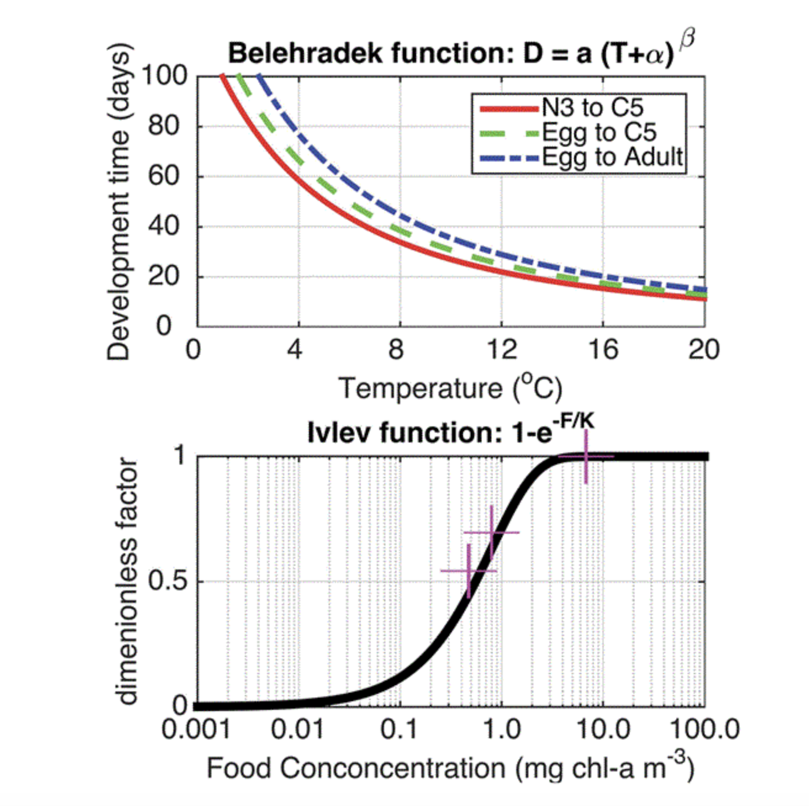
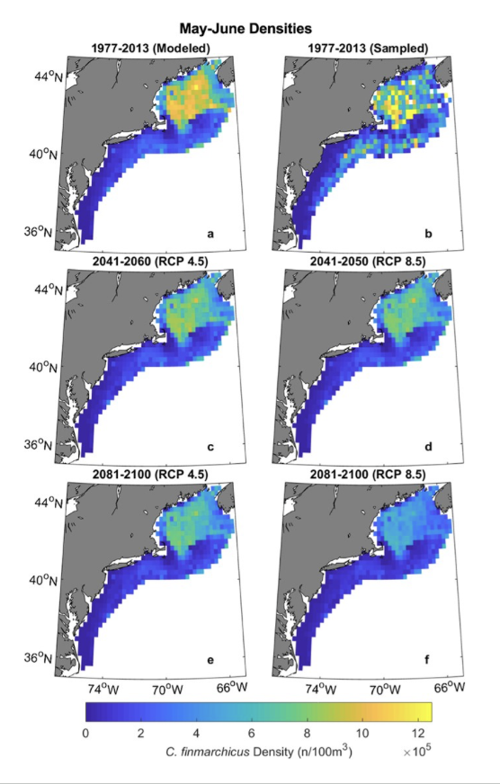

```{r setup, include=FALSE}
knitr::opts_chunk$set(echo = TRUE)
source("/home/isgott28/ColbyForecasting/setup.R")
```

Introduction

  Cetorhinus Maximus, or The Basking Shark, is the second-largest species of shark in the world. Basking Sharks are only just beginning to be understood for their strange biology and ecology. While other species may have information regarding overall global population distributions and life spans, Basking Sharks lack in this data(Westgate et al). But as mentioned by David W. Sims in Chapter 3 of his book on Advances in Marine Biology: "Recent advances in electronic tag technology have enabled considerable progress within the last few years to be made in identifying movements, behavior and habitat preferences." Forecasting becomes a challenge when many details are up for speculation, but understanding even the smallest details can help when attempting to make a prediction on the distribution of Basking Sharks in the year 2050 and beyond. 
  
DATA and MODELS

```{r summer_distrib,echo=FALSE}
obs = read_observations() |>
  mutate(month = factor(month, levels = month.abb))

ggplot(data = obs,
       mapping = aes(x = month)) + 
  geom_bar() + 
  labs(title = "Counts per month")
```

  Figure 1: The numbers of Basking Sharks over a normal year. Notice that the majority of the sharks are seen between the months of April and August, with a majority in June. This tell us that Basking Sharks prefer warmer temperatures, specifically temperatures in the warmer temperate regions (Sims,2008). 
  
  Knowing that Basking Sharks prefer warmer waters doesn't tell us enough about their distribution in the past and future, because even if the climate warms, why would the Basking Sharks care? A good reason for why this matters is because of prey preferences. First, Basking Sharks, like many other filter-feeders, travel along the currents and follow their prey. Unlike species that are smaller and require less microscopic food to sustain basic functions, the Basking Shark requires a high density of plankton in order to survive. Basking Sharks, as well as other predators in the area, such as the endangered North Atlantic Right Whale, feed on copepods like Calanus finmarchicus or C.fin. While Basking Sharks may not have a strict preference in temperatures, C.fin do. Warming global temperatures may displace populations of this food source and may cause their predators to move elsewhere. 
  
```{r plot_month3,echo=FALSE}
SPECIES3= scientificname= "Calanus finmarchicus"
obs3 = read_obis(SPECIES3)
obs3 |>
  filter(is.na(individualCount)) |>
  slice(1) |>
  browse_obis()
obs3 = obs3 |>
  filter(!is.na(individualCount))
ggplot(data = obs3,
       mapping = aes(x = month)) + 
  geom_bar() + 
  labs(title = "Counts per month: Calanus finmarchicus")
```

  Figure 2: The same monthly distribution but looking at Calanus finmarchicus.Unfortunatly, this data doesn't provide enough information to determine if there is a preference. If there was a spike in one month rather than the other, this would tell us that there is a strong preference. 
  It is clear that the prey do have preferences. Experiments have been conducted before to determine how temperatures impact the life cycle of C.fin. Below is the Individual Base model described in Figure 2 of the journal article, "Coastal Amplifications of supply and transport (CAST): a new hypothesis about the persistence of Calanus finmarchicus in the Gulf of Maine."
  

  In addition, there is a range in change in development time in the species with an x-value of temperature. It is important to note that as the temperature goes up, the development time goes down. This change is seen between N3-C5 range, Egg to C5 range, and Egg to Adult range as shown below.
  
  
  
  So now we know that prey distribution matters. Next, we shall create graphs for both the current distribution of Basking Sharks as well as the distribution of Calanus finmarchicus. It is highly unlikely that this alone matters for forecasting the future of Cetorhinus maximus. For example, boating accidents and poaching may be an important factor as seen with Right Whales(Ross et al,.2021). 
  
```{r load_obs_mask,echo=FALSE}
coast = read_coastline()
obs = read_observations(scientificname = "Cetorhinus Maximus")
db = brickman_database() |>
  filter(scenario == "STATIC", var == "mask")
mask = read_brickman(db)
LON0 = -67
LAT0 = 46
all_counts = count(st_drop_geometry(obs), month)

thinned_obs = sapply(month.abb,
               function(mon){ 
                 thin_by_cell(obs |> filter(month == mon), mask)
               }, simplify = FALSE) |>
  dplyr::bind_rows() 

thinned_counts = count(st_drop_geometry(thinned_obs), month)

ggplot() +
  geom_sf(data = thinned_obs, 
          alpha = 0.2, 
          shape = "circle small", 
          size = 1) +
  geom_sf(data = coast, col = "orange") +
  geom_text(data = thinned_counts,
            mapping = aes(x = LON0, 
                          y = LAT0, 
                          label = sprintf("n: %i", .data$n)),
                          size = 3) + 
  labs(x = "Longitude", y = "Latitude", title = "Thinned observations") +
  facet_wrap(~month)

```
  
  Figure 3: A visualization of where the Basking Sharks are located and during which months. The data has been thinned to not include NA values. 
  
  Figure 3 proves the observation in Figure 1, so it is clear that the Basking Sharks are seen more frequently in between the months of May and August, with the maximum located in June and the minimum located in January. This matters because it can be compared to the changes in distribution with Calanus finmarchicus. When looking at the northeastern ocean database, changes in the density of C.fin can be seen over spring, summer, fall, and winter between the range of year 2003-2009 and 2010-2021. 
  (INSERT PICTURES)Figure 3a, 3b, 3c, 3d
  

```{r bias_map,echo=FALSE}
bias_map = rasterize_point_density(obs, mask) 

ggplot() +
  geom_stars(data = bias_map, aes(fill = count)) +
  scale_fill_viridis_b(na.value = "transparent") +
  geom_sf(data = coast, col = "orange") + 
  labs(x = "Longitude", y = "Latitude", title = "Bias map using all observations")
```

  Figure 4: Bias map of all observations. A majority of the sightings appear to be located in a central area. It is unknown why, but that is why we will be looking at co-variables that might influence their range.

```{r read_brickman, echo=FALSE,warning = FALSE}
db = brickman_database() |>
  dplyr::filter(scenario == "PRESENT", interval == "mon")
present = read_brickman(db)
pairs(present)
keep = filter_collinear(present, method = "cor_caret", cutoff = 0.65)
drop_me = attr(keep, "to_remove")
keep = c("depth", "month", keep)
model_input = read_model_input(scientificname = "Cetorhinus Maximus")
present = read_brickman(add = c("depth"))
variables = extract_brickman(present, model_input, form = "wide")
variables = variables |>
  mutate(class = model_input$class) |>   
  select(-.id)                
plot_pres_vs_bg(variables |> select(-month), "class")
```
  
  Figure 5: The covariables. These results show that a forecast has a high chance of being inaccurate due to the variance of the data. Some data is simple, such as depth revealing that both presence and background class Basking Sharks seem to prefer shallower water with an inconsistent preference in sea surface temperature and a more consistent preference in sea bottom temperature. Although this may seem odd, considering the date on Calanus finmarchicus, it makes sense that a specific predator would spend more time in a location where their prey may have a stronger preference. In relation to Calanus finamarchicus, it has been stated in many studies that they are extremely sensitive to changes in temperatures. (Rubao Ji et al,2017).
  


  According to the above projections based on C.fin samples taken between the years 1977-2013, the population of the copepods will get progressively low in both RCP 4.5 and RCP 8.5 figures showing density within the May-June range. The change in density with the forecast model is significant and mirrors the changes mentioned in the observed density over different seasons and year ranges in figures 3a, 3b, 3c, and 3d. The change occuring in the year range 2003-2009 and 2010-2021 seems similar to the change occurring between the year range 2041-2060 and 2081-2100. This shows that both models can be reliable since both models predict a downward trend in density.  
  
Forecast

  There were two methods of forecasting the presence of Cetorhinus Maximus. While looking at data from Right Whales and Calanus finmarchicus may provide information about prey and potential shared predators, the difference is still clear: Basking Sharks aren't right whales and the data deficiency makes forecasting accuracy decrease. One method is through R-studio with the figure below: 
  
```{r load_data,echo=FALSE}
cfg = read_configuration(scientificname = "Cetorhinus Maximus", version = "v1")
model_input = read_model_input(scientificname = "Cetorhinus Maximus", 
                               version = "v1",
                               log_me = c("depth", "Xbtm")) |>
  dplyr::mutate(month = month_as_number(.data$month)) |>
  select(all_of(c("class", cfg$keep)))
model_input_split = spatial_initial_split(model_input, 
                        prop = 1 / 5,     
                        strategy = spatial_block_cv) 
autoplot(model_input_split)
```

  Figure 6: Spatial training data. Like the Ai model mentioned later, the data is fed into a system and separated into testing and training. 

```{r tr_data,echo=FALSE}
tr_data = training(model_input_split)
cv_tr_data <- spatial_block_cv(tr_data,
  v = 5,     
  cellsize = grid_cellsize(model_input),
  offset = grid_offset(model_input) + 0.00001
)
model_fits=read_model_fit(filename = "Cetorhinus_Maximus-v1-model_fits")
model_fit_confmat(model_fits)
model_fit_roc_auc(model_fits)
```

  Figure 7: The confusion matrix for the data as well as the accuracy of different methods of forecasting. Based off of this information and the "AUC:" values we can see that a random forest(default_rf) model would work best with accuracy at 0.810. The second best option is a boosted tree format. The accuracy isn't too low to make a prediction in other formats, but accuracy is important when making forecasts. 
  

```{r rf, echo=FALSE}
model_fit_pdp(model_fits, wid = "default_rf", title = "Random Forest")
```

  Figure 8: The forecast with different covariables. 

  As mentioned previously, there was a second method to predicting the distribution of Basking Sharks.In addition to the previous method of forecasting, an AI model was created using AnythingLLM, Python3, and Ollama. The chosen base model for the AI is Google Gemini. The data in this paper as well as the citations described were all fed into the machine. The prompt generated was something like "based on the given information, predict the presence of Cetorhinus Maximus/Basking Sharks in the year 2050." Its result is as follows, but trimmed down for convenience due to specific papers being repeated within the answer. It should also be mentioned that each line will have commentary:
"Current and Historical Presence:
Seasonal Presence: Basking sharks are observed seasonally in the Gulf of Maine and surrounding waters. Peak sightings in May, June, and July, with a noticeable presence from April through October." This first line shows that our observations on a preferred temperature or seasonal presence is correct or at least noticed in other algorithms.
"Geographic Distribution: Significant basking shark presence along the coast of Maine, extending south into the broader northeastern United States continental shelf waters, including the Gulf of Maine.
Aggregations: Large aggregations, though relatively rare compared to individual sightings (89% were single sightings, 99% were groups of seven or fewer), have been documented in summer and autumn months off the northeastern United States, including the Gulf of Maine. The largest recorded aggregation included up to 1398 individuals.
Environmental Preferences: These aggregations are associated with sea surface temperatures (SSTs) typically ranging from 13 to 24°C and chlorophyll-a (Chl-a) concentrations of 0.4 to 2.6 mg m⁻³. They are linked to dense zooplankton patches, such as Centropages typicus." Many of this information is already known such as clusters of individuals sighted and the preferred sea surface temperatures. 
"Predicted Presence in the Gulf of Maine in 2050:
Given the slow recovery rate, historical depletion, and potential impacts of climate change, it is unlikely that the presence of Basking Sharks in the Gulf of Maine will significantly increase by 2050, and their conservation status is likely to remain a concern." This is a simple prediction, but the Ai goes further to describe key factors that influenced its prediction:
"Slow Recovery: Basking sharks have slow growth rates, late maturity, and low productivity, making their populations highly sensitive to exploitation and recovery very slow. The eastern Canadian population is considered depleted.
Climate Change Impacts on Habitat: The Gulf of Maine is experiencing rapid warming. If SSTs in the region consistently exceed the basking sharks’ preferred range (13–24°C), their distribution could shift northward or to deeper waters. This could potentially reduce their presence in traditional Gulf of Maine foraging grounds.
Climate Change Impacts on Prey: Basking sharks rely on dense zooplankton blooms for feeding. Climate change can alter oceanographic conditions, impacting the timing, location, and species composition of these zooplankton blooms (e.g., chlorophyll-a concentrations). Disruptions to their primary food source could directly affect their presence and foraging success in the Gulf of Maine.
Observed Trends: While the “Counts per year” graph shows an increase in recorded sightings from around 2000 to 2015, it also indicates a sharp decline in counts between 2015 and 2020. Without specific data on survey effort, it’s difficult to interpret this solely as a population trend, but it does not suggest a robust, rapidly recovering population.
In summary, Basking Sharks are likely to continue to be present in the Gulf of Maine during summer and autumn months in 2050, given its historical importance as a foraging ground. However, their abundance is expected to remain low due to inherent biological limitations for recovery and potential shifts in habitat suitability and prey availability driven by ongoing climate change." There is a graph here unmentioned until now so below is Figure 9: the change in the presence of Basking sharks over many year. This wasn't mentioned previously due to the lack of definitive proof that specific years had more of an impact than others. 


```{r counts_per_year, echo=FALSE}
ggplot(data = obs,
       mapping = aes(x = year)) + 
  geom_bar() + 
  geom_vline(xintercept = c(1982, 2013), linetype = "dashed") + 
  labs(title = "Counts per year")
```
Figure 9: Counts per year. There is a spike in population in 2002, a decrease in 2010, an increase a year later, and a sharp increase in 2013. Numbers then decreased in 2020. Numbers were low in previous years as well. 

Conclusion

The future may be AI, but AI can only go so far with a forecast. As demonstrated in the overview above, the accuracy of an AI is near equivalent to other forms of predicting. In conclusion, there needs to be increased efforts in learning more about these creatures and perhaps understanding variables that may have been overlooked, such as boating routes and whale watching sights. Until then, scientists will celebrate any discovery that may hold the secret to saving the oceans. 

Citations

Andrew J Westgate, Heather N. Koopman, Zach A. Siders, Sarah N.P. Wong, Robert A. Ronconi, Population density and abundance of basking sharks Cetorhinus maximus in the lower bay of Fundy, Canada, Department of Biology and Marine Biology, Volume 23, published online March 10.

Camille H. Ross,  Daniel E. Pendleton,  Benjamin Tupper,  David Brickman,  Monica A. Zani, Charles A. Mayo,  Nicholas R. Record: Projecting regions of North Atlantic right whale, Eubalaena glacialis, habitat suitability in the Gulf of Maine for the year 2050, Collections: Knowledge Domain: Ocean Science , Special Feature: Gulf of Maine 2050: Visioning Regional Resilience and Sustainability, Elementa: Science of the Anthropocene (2021) 9 (1): 00058. Published online April 28,2021. 
https://doi.org/10.1525/elementa.2020.20.00058

David W. Sims,Chapter 3 Sieving a Living: A Review of the Biology, Ecology and Conservation Status of the Plankton‐Feeding Basking Shark Cetorhinus Maximus, Advances in Marine Biology, Academic Press, Volume 54, 2008, Pages 171-220, ISSN 0065-2881,ISBN 9780123743510,
https://doi.org/10.1016/S0065-2881(08)00003-5.

Grieve, B.D., Hare, J.A. & Saba, V.S. Projecting the effects of climate change on Calanus finmarchicus distribution within the U.S. Northeast Continental Shelf. Sci Rep 7, 6264 (2017). https://doi.org/10.1038/s41598-017-06524-1

Rubao Ji, Zhixuan Feng, Benjamin T. Jones, Cameron Thompson, Changsheng Chen, Nicholas R. Record, Jeffrey A. Runge, Coastal amplification of supply and transport (CAST): a new hypothesis about the persistence of Calanus finmarchicus in the Gulf of Maine, ICES Journal of Marine Science, Volume 74, Issue 7, September-October 2017, Pages 1865–1874, https://doi.org/10.1093/icesjms/fsw253

Stefán Th Eysteinsson, María Gudjónsdóttir, Sigrún H. Jónasdóttir, Sigurjón Arason, Review of the composition and current utilization of Calanus finmarchicus – Possibilities for human consumption, Trends in Food Science & Technology, Volume 79, 2018, Pages 10-18, ISSN 0924-2244, https://doi.org/10.1016/j.tifs.2018.06.019.
