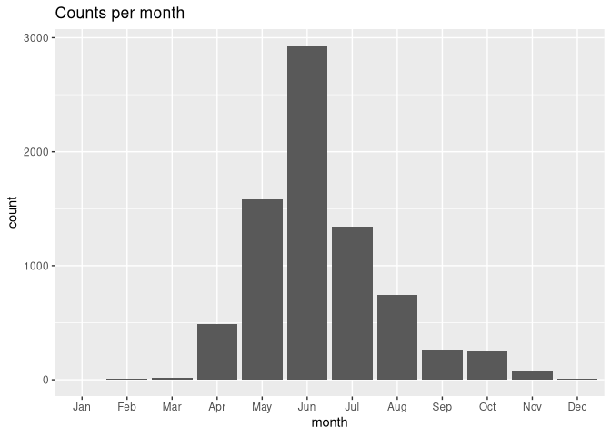

Forecasting Cetorhinus Maximus
================

Introduction

Cetorhinus Maximus, or The Basking Shark, is the second-largest species
of shark in the world. (). This species feeds on zooplankton such as
copepods in the Genus Calanus(). Not much is currently known about
Basking Sharks, such as their migratory patterns and behavior().
Understanding this is important when making decisions about
conservation. For one, the Basking Shark drifts with the currents,
feeding through ‘filters.’ They rely on high density of food to survive.
Because climate change has potentially disrupted the distribution of
this prey, many creatures have been impacted, including the Right Whale.
Understanding the behavior of the prey can help understand the behavior
of the predator, and with a species that isn’t as well studied as the
Basking Shark, this information can be crucial to understand how to
combat climate change. Like many sharks, the Basking Shark has been
hunted for their liver oil, skin leather, and flesh. it is thought to be
understood that they move with their prey, but their courtship behaviors
have only just begun to be understood() .

They prefer temperatures between 8-15 degrees, but according to the
data(cite) in the Gulf of Maine they prefer summer.

<!-- -->
